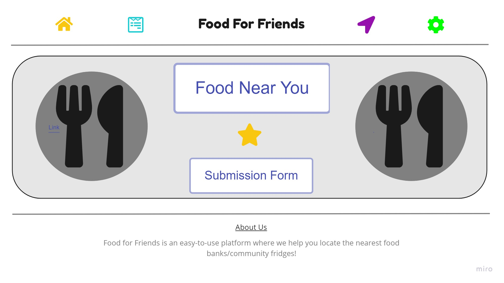
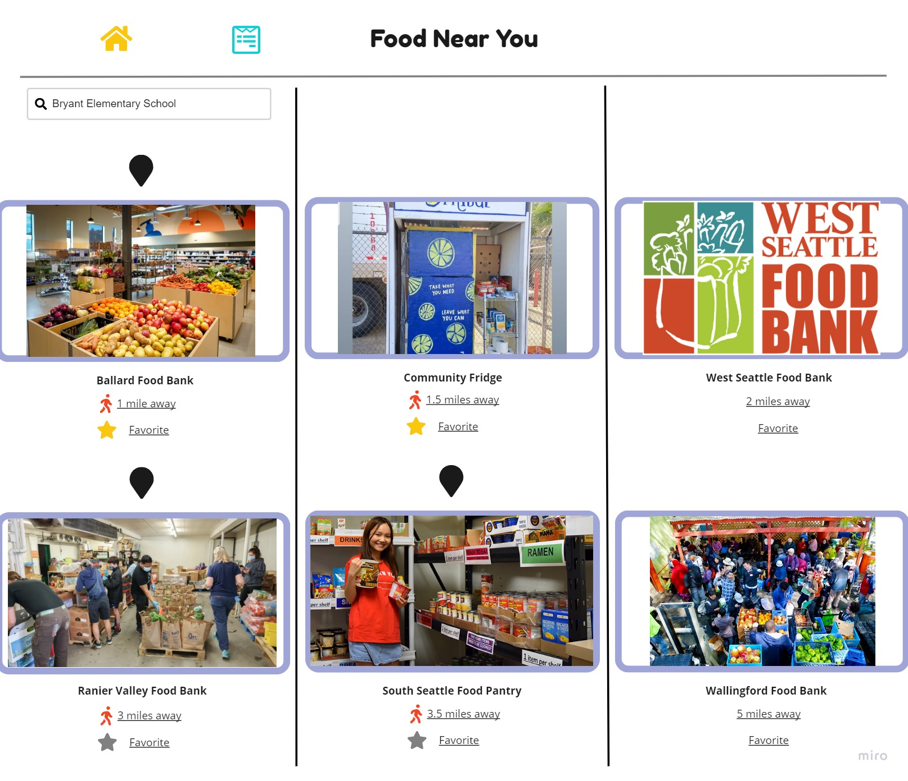
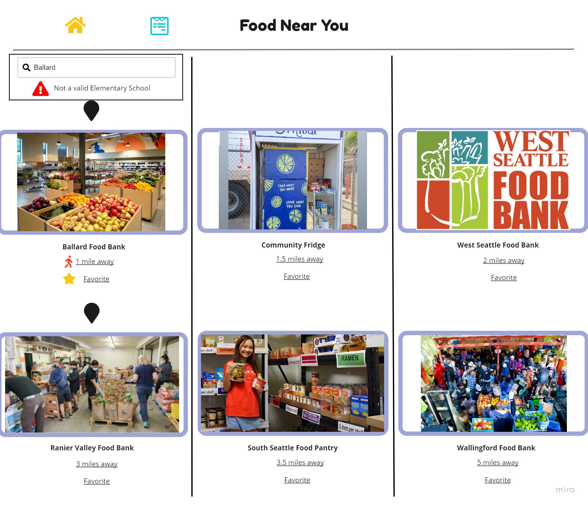
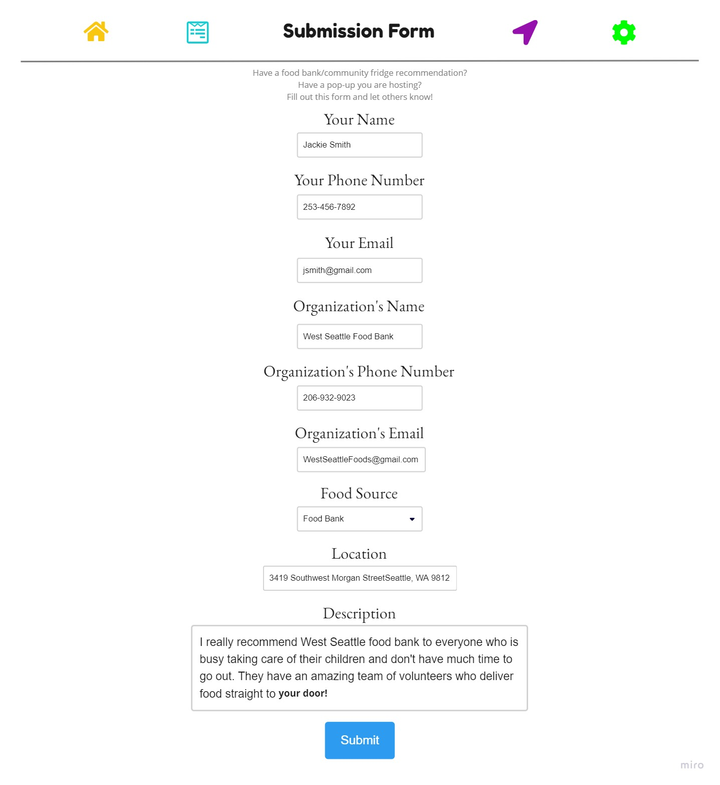
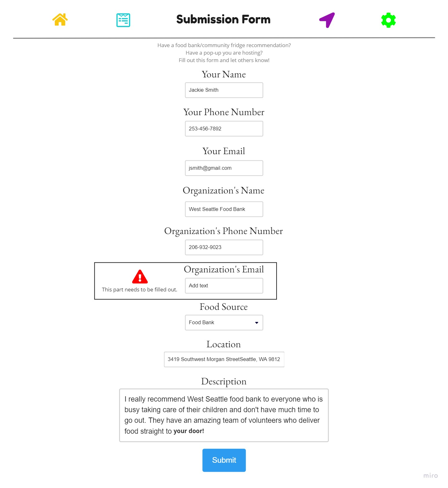
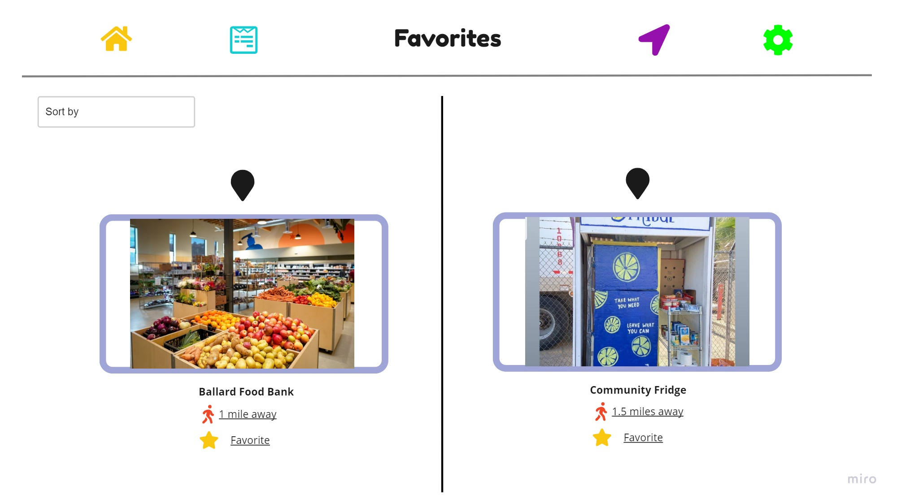
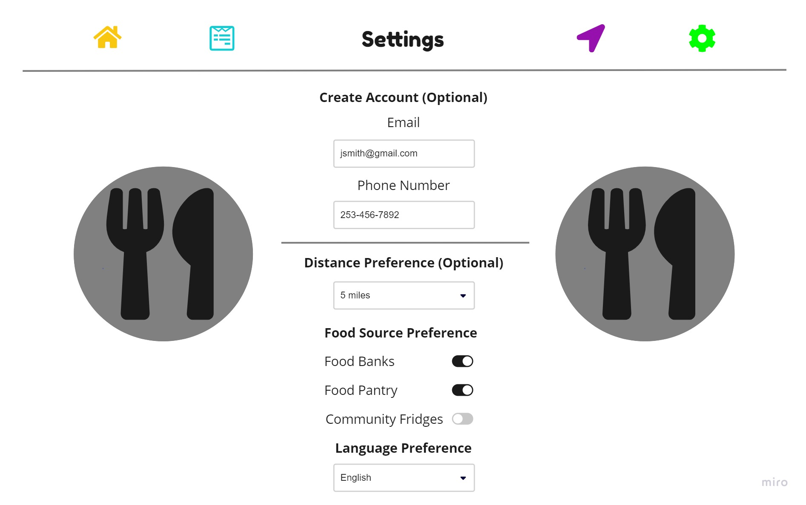

# Food For Friends Specifications
Team Name: Food for Friends

#### Members and Roles
**Project Manager**: Pranav Shekar

**Developers**: SooBin Park, Christian Calloway

**Designer**: Jaehoon Cho

## Problem
### Mission Statement
Centralizing localized food data to combat food insecurity.

### Problem Statement
According to Healthy People 2030, food insecurity is defined as “the disruption of food intake or eating patterns because of lack of money and other resources,” (Food Insecurity, 2020). The United Nations’ Sustainable Development Goals estimates that globally 650 million people were quoted to be going hungry, with an even larger number of 2 billion people estimated to be facing food insecurity (SDG Indicators). The USDA Economic Research Service also claims that of these numbers, within the United States, 38.3 million people live in food insecure families, and from that, about 6.1 million children were living in a family with food insecurity (Coleman-Jensen et al.). Oftentimes, children who face food insecurity are more likely to perform poorly in school compared to their peers. Without proper nutrition, they are at a greater risk of increased hospitalizations, developmental risk, behavior problems, and anxiety to name a few. Additionally, with the ongoing COVID-19 pandemic, families who were already at risk of food insecurity are facing even greater hardships with limited capacity at food pantries as an example. Our solution aims to target these demographics and reduce the amounts of families and children facing hunger.

Currently, a major cause of food insecurity is the long-existing systematic social discrimination, such as the practice of Supermarket Redlining. Concerned with low-profit margins, many supermarkets are reluctant in opening stores in inner cities and neighborhoods of lower socioeconomic status, which makes food sparse in certain areas (Mukherjee, 2020). Moreover, the lack of access to public transportation or a personal vehicle further prevents families in these neighborhoods from regularly traveling to supermarkets. Thus, the families often have to compromise and shop at convenience stores rather than grocery stores. However, the unaffordable prices at convenience stores are yet another factor that limits access to foods (Food Insecurity, 2020). With all that said, families rely on information about food banks, pantries, and fridges to get donated food; however, there is no comprehensive and user-friendly information that connects these families in need to every available food source.

Existing solutions, such as Feeding America–while providing location-centered information–tend to concentrate data exclusively around food banks. Consequently, this can end up missing mutual aid work and pop-up food pantries that can provide relief to families facing food insecurity (“Find Your Local Food Bank.”). On a more local scale, groups like Seattle Food Committee, however, provide more detailed information on food resources, yet they lack map-based and location-based features that would allow for a smoother user experience; oftentimes, smaller companies do not have the resources to do this (Seattle Food Committee). Taken together, larger solutions tend to not be specific enough to the area and culture while smaller solutions struggle to scale their data in a way that is meaningful. 

### References
Coleman-Jensen, Alisha, et al. “Key Statistics &amp; Graphics.” USDA ERS - Key Statistics &amp; Graphics, U.S Department of Agriculture, 8 Sept. 2021, https://www.ers.usda.gov/topics/food-nutrition-assistance/food-security-in-the-u-s/key-statistics-graphics/#:~:text=In%202020%3A,with%20adults%2C%20were%20food%20insecure. 

“Find Your Local Food Bank.” Feeding America, https://www.feedingamerica.org/find-your-local-foodbank. 
“Food Insecurity.” Food Insecurity | Healthy People 2020, Office Of Disease Prevention and Health Promotion, www.healthypeople.gov/2020/topics-objectives/topic/social-determinants-health/interventions-resources/food-insecurity#:~:text=Access%20to%20healthy%20foods%20is,and%20supermarkets%20or%20grocery%20stores.&text=Residents%20are%20at%20risk%20for,and%20there%20are%20fewer%20supermarkets. 

Hake, Monica, et al. The Impact of the Coronavirus on Food Insecurity, Feeding America, Mar. 2021, https://www.feedingamerica.org/sites/default/files/2021-03/National%20Projections%20Brief_3.9.2021_0.pdf. 

“Household Food Insecurities: Threats to Children's Well-Being.” American Psychological Association, American Psychological Association, https://www.apa.org/pi/ses/resources/indicator/2012/06/household-food-insecurities. 

Mukherjee, T. (2020, September 28). Redlining’s Legacy: Food Deserts, Insecurity, and
Health. Morning Sign Out Health and Science Made Simple. Retrieved April 10, 2022, from https://sites.uci.edu/morningsignout/2020/09/28/redlinings-legacy-food-deserts-insecurity-and-health/. 

“SDG Indicators.” United Nations Sustainable Development Goals Report 2021, United Nations, 2021, https://unstats.un.org/sdgs/report/2021/goal-02/. 

Seattle Food Committee, 7 Apr. 2022, https://www.seattlefoodcommittee.org/. 

## Solution Summary
Food For Friends aims to combine aspects of location-based information with expansive knowledge of food resources (including mutual aid groups, food banks, community fridges, etc.) to combat food insecurity in Seattle, Washington. We allow users to quickly and efficiently find food resources near them, with a focus on eliminating family and child food insecurity.

## Design
### Home Page

The home page consists of a 
<ul>
<li> Navigation bar </li>
<li> Body </li>
<li> Footer </li>
</ul>

-In the navigation bar, our website/team name is adjusted at the center, with four buttons as well: Home page, Food Near You page Submission Form page, Favorites page, and Settings which I will explain more in detail below. These buttons are on all the other pages as well so that it is more convenient for the users to switch between tabs.  
-In the body of the Home page, users can either go to the Food Near You, Favorites, or Submission Form page.  
-In the footer, information about our organization is presented to the users.

 
 

<em> Figure 1: Homepage</em>

 
 

### Food Near You
The Food Near You page is where the user would simply search the elementary school nearest to them in the search bar. We chose to do this because many families with young children tend to struggle with food insecurity. Thus, if we show results near their elementary school, it could be convenient for the family. The page will then present them with the nearest food pantries near that school. With each location, the name of the organization will show, along with the distance from the user's current location, and an option to favorite. When favorited, the favorite icon will turn yellow. 
Our stretch goal is to make food pantries available from any location and not just limited to elementary schools. Another stretch goal we have is to integrate a map feature that allows users to visually see where food resources are located geographically. 

 
 

<em> Figure 2.1: Food Near You Page</em>

 
 

If the inputted location is not an elementary school in Seattle, an error message will pop up letting the user know. The user will have to change their location to see results.

 
 

<em> Figure 2.2: Food Near You Page with an Error</em>

 
 

### Submission Form
Because we recognize that food resources can change and develop, we have integrated a submission form to make our solution more community-based. The Submission Form page allows users to recommend a food pantry, notify others that they are hosting a pop-up, etc. The sections consist of: 
<ul>
<li> Form submitter’s name </li>
<li> Form submitter’s phone number </li>
<li> Form submitter’s email </li>
<li> Organization’s name </li>
<li> Organization’s phone number </li>
<li> Organization’s email </li>
<li> The type of food source: food bank, food pantry, or community fridge </li>
<li> Location of the food pantry </li>
<li> Description (recommendation, hosting pop-up, fast service, delivery service, etc.) </li>
</ul>
 
 

<em> Figure 3.1: Submission Page</em>

 
 

If a part of the submission form isn’t filled out, an error message is displayed. Only once that part has been properly filled out will the user be able to submit their form. This is so that other users can reach out to the person or organization if they have any questions or concerns. 

 
 

<em> Figure 3.2: Submission Page with an Error</em>

 
 

### Favorites
The Favorites page will list the users favorite food pantries. There is a dropdown menu that gives the user options to sort it by either distance or most recently favorited.
 
 

<em> Figure 3: Favorite Page</em>

 
 

### Settings
On our Settings page, users input their email, phone number, distance preference, food source preference, and language preference. Creating an account and distance preference are optional, but food source preference and language preference are required. 
-Distance preferences can range from 0 to 15 miles.  
-Food source preference has food banks, food pantries, and community fridges as the options.  
-Language preference has English as the default language.

 
 

<em> Figure 3: Settings Page</em>

 
 